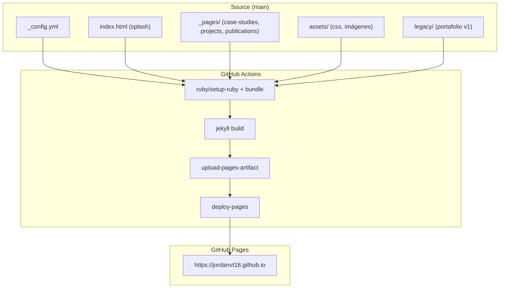

# jordanvillont.github.io — Portafolio Profesional

> **Status:** `Production` · **Domain:** Personal Portfolio / GitHub Pages · **Last validated:** 2026-08

[](Gemfile)
[](_config.yml)
[](.github/workflows/pages.yml)
[](LICENSE)

## 📌 Executive Summary

Portafolio profesional de **Principal Data Scientist** construido con Jekyll + Minimal Mistakes,
desplegado automáticamente con GitHub Actions a GitHub Pages. Incluye página de inicio con filosofía
de liderazgo, **case studies** de los 4 proyectos de mayor impacto (valorización urbana,
bioseguridad camaronera, detección de enfermedades en banano, transparencia municipal), página de
proyectos completa y publicaciones. El portafolio anterior se conserva en `legacy/`.

## 🎯 Business Impact & KPIs

| Business problem | KPI optimized | Baseline | Target | Observed |
|---|---|---|---|---|
| Posicionamiento para roles Principal/Sr/Lead/Head of Data | Visibilidad del portafolio | Sitio single-page | Sitio estructurado + SEO | **4 páginas + SEO + sitemap** |
| Evidencia profunda de impacto | Profundidad de case studies | Lista de proyectos | 4 estudios detallados | **4 case studies con KPIs** |
| Despliegue manual frágil | Automatización del deploy | Manual | CI/CD | **GitHub Actions automático** |

## 🧠 Methodology & Statistical Rigor

- **Enfoque:** sitio estático Jekyll con tema **Minimal Mistakes** (gem), contenido en español
  (mercado objetivo Ecuador/LatAm), SEO via `jekyll-seo-tag` y sitemap automático.
- **Estructura de evidencia:** cada case study sigue el mismo rigor que los repos: problema de
  negocio → método → resultados con KPIs → enlace al código.
- **Supuestos:** el despliegue usa GitHub Actions (source `workflow`); el build corre en CI con
  Ruby 3.3 + Bundler.

## 🏗️ System Architecture



## 📊 Results

| Metric | Value | Detail |
|---|---|---|
| Páginas | 4 principales | Inicio, Case Studies, Proyectos, Publicaciones |
| Case studies | 4 | Radar urbano, Bioseguridad, Banano, Transparencia |
| SEO | Automático | `jekyll-seo-tag`, sitemap, metadatos |
| Deploy | Automático | GitHub Actions → Pages (workflow) |
| Legacy | Conservado | `legacy/index.html` (portafolio v1) |

## 🛠️ Tech Stack

| Layer | Tools |
|---|---|
| Generador | Jekyll 4 + tema Minimal Mistakes (base), layouts y design system propios estilo Figma |
| Plugins | jekyll-feed, jekyll-seo-tag, jekyll-sitemap, jekyll-include-cache, jekyll-paginate |
| CI/CD | GitHub Actions (configure-pages, jekyll-build-pages, deploy-pages) |

## 📂 Project Structure

```
.
├── _config.yml                # Configuración del sitio (locale, author, nav, defaults)
├── index.html                 # Home (layout figma-home)
├── _layouts/                  # figma-home.html, figma-page.html (diseño custom)
├── _includes/                 # figma-head, figma-nav, figma-footer
├── _pages/                    # case-studies.md, projects.md, publications.md
├── assets/
│   ├── css/figma.css          # Design system (tokens, componentes)
│   └── images/                # avatar.svg, hero.svg, projects/ (fotos reales)
├── legacy/index.html          # Portafolio v1 conservado
├── Gemfile                    # Dependencias Ruby
├── .github/workflows/pages.yml
├── 404.html, robots.txt
└── README.md
```

## Créditos de imágenes

- Fotos de Quito (El Panecillo), Guayaquil (Malecón), plantación de banano y piscinas camaroneras: **Wikimedia Commons**, licencias libres.
- Predicciones del modelo de banano, curvas de entrenamiento, matriz de confusión y ridgeline de criminalidad: **generadas por los propios repositorios** del portafolio.

## 🚀 Quick Start

```bash
git clone https://github.com/jordanvt18/jordanvillont.github.io
cd jordanvillont.github.io
bundle install
bundle exec jekyll serve --livereload
# → http://localhost:4000
```

**Requisitos:** Ruby 3.3+, Bundler. El deploy es automático: push a `main` → GitHub Actions → Pages.

## 📈 Monitoring & Governance

- **Deploy:** workflow `pages.yml` (build + deploy) con permisos mínimos (`contents: read`, `pages: write`, `id-token: write`).
- **Calidad:** build reproducible vía `Gemfile.lock` (generada en CI); contenido versionado por commits.
- **Mantenimiento:** agregar proyecto = nueva entrada en `_pages/projects.md`; agregar case study = nueva sección en `case-studies.md`.
- **Redirección:** el portafolio v1 permanece accesible en `/legacy/` para enlaces históricos.
